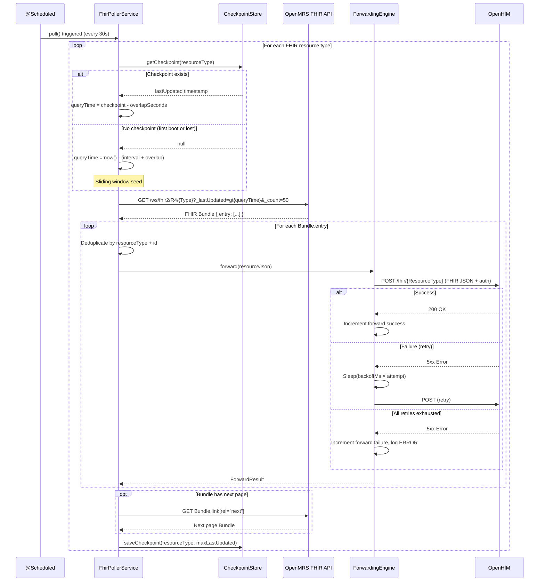
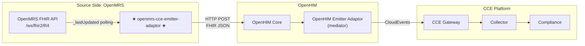

# Architecture — OpenMRS CCE Emitter Adaptor

## 1. Service Purpose

The **OpenMRS CCE Emitter Adaptor** polls OpenMRS APIs for resource changes and forwards them to OpenHIM, where a downstream mediator wraps events in CloudEvents and routes them to CCE. It uses **polling** because OpenMRS does not support FHIR Subscriptions.

---

## 2. System Context

```
  OpenMRS Instance ──(FHIR R4 API)──► ★ OpenMRS Emitter Adaptor ★
                                                       │
                                                       │ HTTP POST (FHIR JSON)
                                                       ▼
                                              OpenHIM (Mediator)
                                                       │
                                                       │ CloudEvents
                                                       ▼
                                              CCE Collector → Kafka → Compliance
```

---

## 3. Component Architecture

```
┌───────────────────────────────────────────────────────────────────────┐
│                     OpenMRS CCE Emitter Adaptor                       │
│                                                                       │
│  ┌─────────────────────────────────────────────────────────────────┐  │
│  │                        Polling Layer                            │  │
│  │                                                                 │  │
│  │  ┌───────────────────────────────────────────────────────────┐  │  │
│  │  │  FhirPollerService                                        │  │  │
│  │  │  @Scheduled 30s                                           │  │  │
│  │  │  _lastUpdated polling                                     │  │  │
│  │  │  FHIR Bundle pagination                                   │  │  │
│  │  │  14 resource types (Patient, Encounter, Observation, ...) │  │  │
│  │  └───────────────────────────────────────────────────────────┘  │  │
│  └──────────────────────────────┬──────────────────────────────────┘  │
│                                 │                                     │
│                                 ▼                                     │
│  ┌─────────────────────────────────────────────────────────────────┐  │
│  │                      Forwarding Layer                           │  │
│  │  ForwardingEngine                                               │  │
│  │  • Build target URL (baseUrl + /ResourceType)                   │  │
│  │  • Attach OpenHIM auth (Basic / JWT / Token)                    │  │
│  │  • POST FHIR JSON with retry + linear backoff                   │  │
│  │  • Return ForwardResult → increment metrics                     │  │
│  └─────────────────────────────────────────────────────────────────┘  │
│                                                                       │
│  ┌─────────────────────────────────────────────────────────────────┐  │
│  │                       Support Layer                             │  │
│  │  CheckpointStore (file / database)  │  EmitterProperties        │  │
│  │  FhirConfig  │  RestClientConfig    │  SchedulingConfig         │  │
│  └─────────────────────────────────────────────────────────────────┘  │
└───────────────────────────────────────────────────────────────────────┘
```

---

## 4. Technology Stack

| Concern | Technology | Version |
|---------|------------|---------|
| Language | Java | 21 (LTS) |
| Framework | Spring Boot | 3.4.x |
| Build tool | Gradle (Groovy DSL) | 8.x |
| FHIR library | HAPI FHIR Client | 7.4.0 |
| HTTP client | Spring `RestTemplate` | (Spring Boot managed) |
| Scheduling | Spring `@Scheduled` | (Spring Boot managed) |
| Health & metrics | Spring Boot Actuator + Micrometer + Prometheus | |
| Testing | JUnit 5, Mockito, WireMock | |

### 4.1 Key Gradle Dependencies

```groovy
// HAPI FHIR (client library for FHIR R4 parsing)
implementation "ca.uhn.hapi.fhir:hapi-fhir-base:${hapiFhirVersion}"
implementation "ca.uhn.hapi.fhir:hapi-fhir-client:${hapiFhirVersion}"
implementation "ca.uhn.hapi.fhir:hapi-fhir-structures-r4:${hapiFhirVersion}"

// Spring Boot starters
implementation 'org.springframework.boot:spring-boot-starter-web'
implementation 'org.springframework.boot:spring-boot-starter-validation'
implementation 'org.springframework.boot:spring-boot-starter-actuator'

// Metrics
runtimeOnly 'io.micrometer:micrometer-registry-prometheus'

// Testing
testImplementation 'org.springframework.boot:spring-boot-starter-test'
testImplementation "org.wiremock:wiremock-standalone:${wiremockVersion}"
```

---

## 5. Package Structure

### 5.1 Source Structure

```
src/main/java/org/openphc/cce/emitter/
├── OpenmrsCceEmitterAdaptorApplication.java      # Spring Boot entry point
├── config/
│   ├── EmitterProperties.java                    # @ConfigurationProperties(prefix="emitter")
│   ├── FhirConfig.java                           # FhirContext.forR4() singleton bean
│   ├── LoggingFilter.java                        # MDC request tracing
│   ├── ObservabilityConfig.java                  # Micrometer common tags
│   ├── RestClientConfig.java                     # Standard + trust-all RestTemplate beans
│   └── SchedulingConfig.java                     # @EnableScheduling + thread pool
├── service/
│   ├── CheckpointStore.java                      # Persists poll checkpoints (file-based)
│   ├── FhirPollerService.java                    # @Scheduled FHIR polling with _lastUpdated
│   ├── ForwardingEngine.java                     # Synchronous forwarding to OpenHIM with retry
│   └── ForwardResult.java                        # Forwarding outcome record
└── model/
    └── PollCheckpoint.java                       # Checkpoint data (resourceType, lastUpdated)
```

| Package | Files | Responsibility |
|---------|-------|----------------|
| `config` | 6 | Configuration properties, FHIR context, REST clients, scheduling, observability |
| `service` | 4 | FHIR polling, forwarding engine, checkpoint persistence |
| `model` | 1 | Checkpoint data record |

### 5.2 Test Structure

```
src/test/java/org/openphc/cce/emitter/
├── OpenmrsCceEmitterAdaptorApplicationTests.java     # Context load test
├── config/
│   ├── EmitterPropertiesTest.java                    # Config binding tests
│   ├── FhirConfigTest.java                           # FhirContext bean tests
│   └── RestClientConfigTest.java                     # RestTemplate bean tests
├── service/
│   ├── FhirPollerServiceTest.java                    # FHIR polling unit tests
│   ├── ForwardingEngineTest.java                     # Forwarding, retry, metrics tests
│   └── CheckpointStoreTest.java                      # Checkpoint persistence tests
└── integration/
    ├── AbstractIntegrationTest.java                  # WireMock base (OpenMRS + OpenHIM stubs)
    ├── FhirPollingIntegrationTest.java               # End-to-end FHIR poll → forward
    └── HealthEndpointIntegrationTest.java            # Actuator health endpoint tests
```

| Suite | Scope | Strategy |
|-------|-------|----------|
| `config/` | Unit | Verify property binding, bean creation |
| `service/` | Unit | Mockito-based — mock RestTemplate, CheckpointStore |
| `integration/` | Integration | WireMock stubs for OpenMRS + OpenHIM HTTP endpoints |

---

## 6. FHIR Resource Mapping

| Resource | FHIR Endpoint | OpenMRS Mapping | `_lastUpdated` |
|----------|---------------|-----------------|----------------|
| Patient | `/Patient` | Patient | Yes |
| Encounter | `/Encounter` | Encounter + Visit (tagged `meta.tag.code=visit`) | Yes |
| Observation | `/Observation` | Obs | Yes |
| Condition | `/Condition` | Condition | Yes |
| Immunization | `/Immunization` | Obs (vaccine concepts) | Yes |
| DiagnosticReport | `/DiagnosticReport` | Encounter + grouped Obs | Yes |
| Procedure | `/Procedure` | Obs (procedure concepts) | Yes |
| MedicationRequest | `/MedicationRequest` | DrugOrder | Yes |
| MedicationDispense | `/MedicationDispense` | Dispensing module | Yes |
| MedicationAdministration | `/MedicationAdministration` | Obs (medication concepts) | Yes |
| ServiceRequest | `/ServiceRequest` | TestOrder | Yes |
| AllergyIntolerance | `/AllergyIntolerance` | Allergy | Yes |
| Location | `/Location` | Location | Yes |
| Practitioner | `/Practitioner` | Provider | Yes |

> **Note:** OpenMRS Visits are returned as FHIR `Encounter` resources with `meta.tag.code = "visit"` — they are automatically included in the Encounter poll. TestOrders map to `ServiceRequest` and DrugOrders map to `MedicationRequest`.

---

## 7. Architecture Principles

| Principle | Application |
|-----------|-------------|
| **Polling-Based** | Polls OpenMRS on a configurable schedule; no webhook dependency |
| **FHIR-Only Strategy** | All resource types polled via FHIR R4 API with `_lastUpdated` |
| **Checkpoint Persistence** | File-based checkpoint store (`checkpoints.json`) survives restarts; database-backed store planned as future enhancement |
| **Sliding Window Seed** | On first boot or checkpoint loss, uses `now() - (intervalSeconds + overlapSeconds)` to avoid full-history fetch |
| **At-Least-Once Delivery** | Overlap window may cause duplicates; downstream CCE handles idempotency |
| **Single Responsibility** | Captures changes and forwards — no transformation |
| **Fail-Safe Polling** | Individual poll failures logged, do not stop subsequent polls |
| **Overlap Window** | 5-second overlap on `_lastUpdated` mitigates timing inconsistencies |
| **Deduplication** | In-memory dedup within each poll cycle |
| **Retry with Backoff** | Failed forwards retried with linear backoff |

---

## 8. Multi-Auth Architecture

The service supports distinct authentication strategies for **OpenMRS** (upstream source) and **OpenHIM** (downstream target).

### 8.1 OpenMRS Authentication

Used by `FhirPollerService` when polling OpenMRS FHIR API.

| Auth Type | Description | Required Config Fields |
|-----------|-------------|------------------------|
| `basic` | HTTP Basic Authentication (default, recommended) | `username`, `password` |
| `bearer` | Static Bearer token in `Authorization` header | `token` |
| `oauth2` | OAuth2 Client Credentials flow — automatic token acquisition and refresh | `oauth2.token-url`, `oauth2.client-id`, `oauth2.client-secret` |

> **OAuth2 support:** Requires the `openmrs-module-oauth2login` module and an external identity provider (e.g., Keycloak). The service uses the OAuth2 Client Credentials grant to obtain an access token, caches it, and automatically refreshes before expiry.

### 8.2 OpenHIM Authentication

Used by `ForwardingEngine` when forwarding detected changes to OpenHIM.

| Auth Type | Description | Required Config Fields |
|-----------|-------------|------------------------|
| `none` | No authentication (development only) | — |
| `basic` | HTTP Basic Authentication | `username`, `password` |
| `jwt` | JWT Bearer token in `Authorization` header | `token` |
| `custom-token` | Custom token in `Authorization` header | `token` |

### 8.3 Auth Resolution Flow

```
Request construction
  ├── Resolve target (OpenMRS or OpenHIM)
  ├── Read auth config from EmitterProperties
  ├── Switch on auth type:
  │   ├── basic  → Base64-encode username:password → Authorization: Basic {encoded}
  │   ├── bearer → Authorization: Bearer {token}
  │   ├── oauth2 → Fetch/refresh token from IdP → Authorization: Bearer {access_token}
  │   ├── jwt    → Authorization: Bearer {jwt-token}
  │   ├── custom-token → Authorization: {token}
  │   └── none   → No auth header
  └── Attach header to outgoing HTTP request
```

---

## 9. Security

| Concern | Implementation |
|---------|----------------|
| OpenMRS auth | HTTP Basic Auth (default), Bearer token, or OAuth2 Client Credentials |
| OpenHIM auth | None, Basic Auth, JWT, or Custom Token |
| SSL/TLS | Trust-all option per connection (dev/staging only) |
| Credentials | Injected via environment variables — never hardcoded |
| Non-root container | Docker runs as `appuser` |

---

## 10. Processing Flows

### 10.1 FHIR Polling Flow

This is the processing path — the scheduled pipeline from OpenMRS FHIR API polling to OpenHIM forwarding:

| Step | Component | Action |
|------|-----------|--------|
| 1 | **FhirPollerService** | `@Scheduled` triggers `poll()` at configured interval (default 30s) |
| 2 | **CheckpointStore** | Read last poll checkpoint for this resource type (returns timestamp or `null`) |
| 3 | **FhirPollerService** | Resolve query time: if checkpoint exists → `checkpoint - overlapSeconds`; if null → `now() - (interval + overlap)` (sliding window seed) |
| 4 | **FhirPollerService** | Build FHIR query: `GET /ws/fhir2/R4/{ResourceType}?_lastUpdated=gt{queryTime}&_count=50&_sort=-_lastUpdated` |
| 5 | **RestTemplate** | Execute GET with Basic Auth header against OpenMRS FHIR API |
| 6 | **FhirPollerService** | Parse FHIR Bundle response via `fhirContext.newJsonParser()` |
| 7 | **FhirPollerService** | Iterate `Bundle.entry[]`, deduplicate by resource type + ID |
| 8 | **ForwardingEngine** | For each resource: POST raw FHIR JSON to OpenHIM with auth + retry |
| 9 | **FhirPollerService** | Follow `Bundle.link[rel="next"]` for pagination until exhausted |
| 10 | **CheckpointStore** | Save `max(meta.lastUpdated)` from all processed resources as new checkpoint |
| 11 | **Metrics** | Increment `poll.executed`, `poll.resources.detected`, `forward.success` / `forward.failure` counters |

#### Sequence Diagram



### 10.2 Where This Service Fits



---

## 11. What This Service Does NOT Do

| Exclusion | Responsibility |
|-----------|----------------|
| Transform or enrich FHIR resources | Resources forwarded as-is — no mapping or enrichment |
| Validate FHIR profile conformance | Only structural parse for metadata extraction |
| Produce or consume Kafka events | HTTP-only forwarding; Kafka is downstream (CCE Collector) |
| Wrap payloads in CloudEvents | CloudEvents wrapping happens in OpenHIM mediator |
| Rate-limit or apply mTLS | Infrastructure-layer concerns |
| Perform compliance tracking | CCE Compliance Service responsibility |
| Subscribe to FHIR Subscriptions | OpenMRS does not support FHIR R4 Subscriptions |
| Act as a Receiver Adaptor | Only emits events toward CCE, does not receive from CCE |
| Detect deleted/voided records | Planned as future enhancement |

---

## 12. Future Enhancements

- **Delete/Void Reconciliation** — REST API with `includeAll=true` to detect voided records invisible via FHIR
- **ProgramEnrollment Polling** — REST API polling for ProgramEnrollments (`/ws/rest/v1/programenrollment`) if required. The FHIR `EpisodeOfCare` endpoint currently supports read-only by UUID without search/`_lastUpdated` support.
- **Database-Backed Checkpoint Store** — Replace file-based checkpoint persistence with a database (e.g., PostgreSQL, H2) for multi-instance deployments and operational resilience
